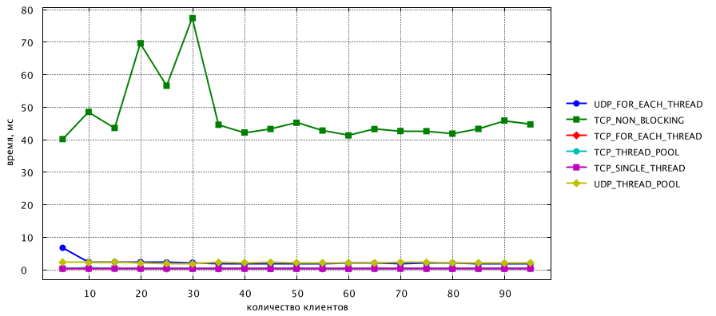
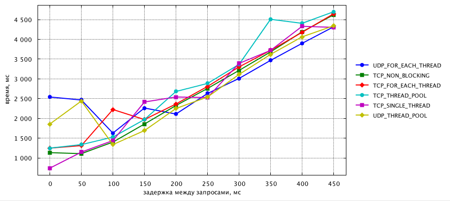

#term4 java servers benchmark

* TCP_FOR_EACH_THREAD
* TCP_SINGLE_THREAD
* TCP_THREAD_POOL
* TCP_NON_BLOCKING
* UDP_FOR_EACH_THREAD
* UDP_THREAD_POOL

результаты лежат в 'src/main/resources'

### test №1
clients=15,
length=from 100 to 2000 step 100,
delay=5,
queries=15

  
  
  

### test №2
clients=from 5 to 100 step 5,
length=1000,
delay=10,
queries=10

  
  
  

### test №3
clients=10,
length=100,
delay=from 0 to 500 step 50,
queries=10

  
  
  